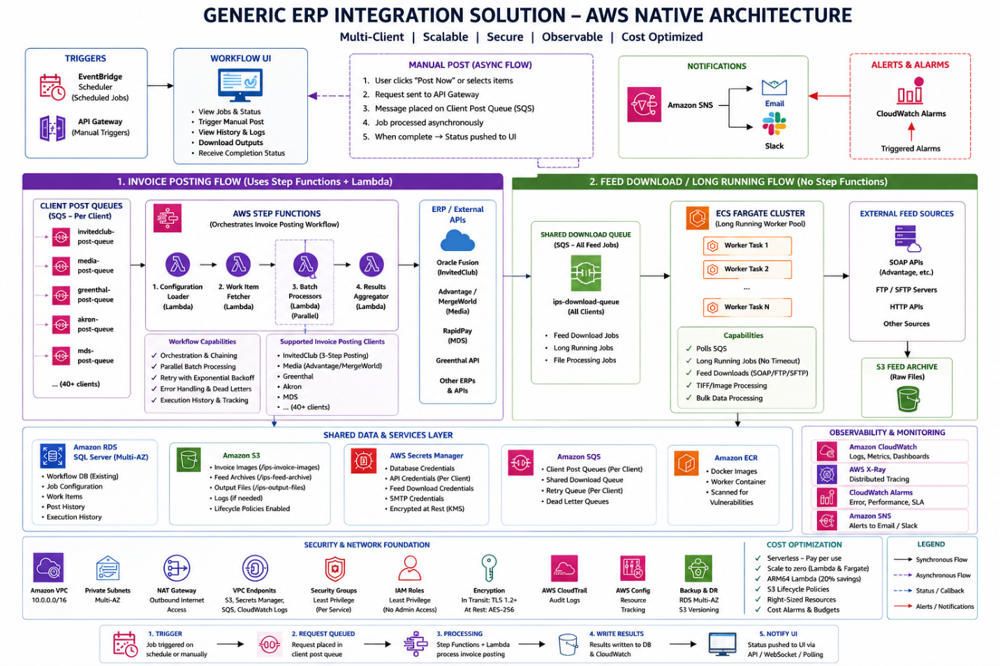

Generic ERP Integration Solution – AWS Native Architecture

Executive Summary

The proposed Generic ERP Integration Solution is a modern, cloud-native integration platform built entirely on Amazon Web Services (AWS). The platform is designed to replace legacy Windows server-based schedulers, desktop services, and tightly coupled ERP integrations with a scalable, secure, highly available, and operationally efficient architecture.

The solution enables automated and manual invoice posting, feed downloads, document processing, image handling, retry management, monitoring, and audit tracking for multiple ERP systems and client-specific integrations.

The architecture is designed around reusable components, centralized orchestration, client-specific plugins, and serverless execution models to support both current and future ERP integrations with minimal infrastructure overhead.

The platform follows AWS Well-Architected best practices across:

Security

Reliability

Operational Excellence

Performance Efficiency

Cost Optimization

Scalability

The solution is fully Infrastructure-as-Code (IaC) driven, CI/CD enabled, and supports multi-client onboarding through configuration-driven execution.

1. Solution Objectives

The Generic ERP Integration Solution is intended to achieve the following objectives:

Modernize legacy integration processes currently dependent on Windows services and on-premise infrastructure

Provide a reusable framework for integrating multiple ERP platforms

Reduce operational dependency on always-on servers

Improve scalability for high-volume invoice and feed processing

Enable secure handling of credentials and sensitive business data

Centralize logging, monitoring, alerting, and operational visibility

Support both scheduled and manual execution models

Minimize infrastructure cost using pay-per-use AWS services

Provide fault isolation and retry capabilities

Standardize deployment and operational processes across all integrations

2. Solution Overview

The architecture is designed as a hybrid execution platform using:

AWS Lambda for serverless processing

AWS Step Functions for workflow orchestration

Amazon ECS Fargate for long-running workloads

Amazon EventBridge Scheduler for job scheduling

Amazon SQS for asynchronous queue-based processing

Amazon RDS SQL Server for transactional data storage

Amazon S3 for file and image storage

AWS Secrets Manager for secure credential management

Amazon CloudWatch and X-Ray for observability and tracing

The platform supports:

Invoice posting integrations

Feed download integrations

ERP synchronization

Image/document handling

Retry workflows

Batch processing

Manual operational triggers

Audit and execution history tracking

3. Architectural Design Principles

The platform is designed around the following principles:

3.1 AWS Native First

The solution prioritizes managed AWS services over self-managed infrastructure to reduce operational overhead and improve reliability.

3.2 Serverless by Default

Invoice posting and orchestration workloads use serverless execution wherever possible to minimize idle infrastructure costs.

3.3 Configuration-Driven Execution

Schedules, routing logic, authentication settings, and client-specific behavior are configuration-based rather than hardcoded.

3.4 Plugin-Based Integration Model

Each ERP/client integration is implemented as a reusable plugin while leveraging a shared orchestration and execution framework.

3.5 Fault Isolation

Failures in one client integration do not impact other clients or workflows.

3.6 Scale-on-Demand

The platform automatically scales based on workload volume and queue depth.

3.7 Security by Design

All credentials, network access, and resource permissions follow least-privilege principles and encrypted communication.

4. Core AWS Services Used

4.1 Amazon EventBridge Scheduler

EventBridge Scheduler acts as the centralized scheduling engine for all automated integration jobs.

Responsibilities:

Trigger scheduled invoice posting

Trigger feed downloads

Support cron-based and interval-based execution

Support timezone-aware scheduling

Eliminate dependency on Windows Task Scheduler

Benefits:

Fully managed scheduling

Zero infrastructure management

High reliability

Very low operational cost

Per-client scheduling flexibility

4.2 AWS Lambda

AWS Lambda hosts the serverless processing components for invoice posting and orchestration.

Responsibilities:

Configuration loading

Work item retrieval

Batch execution

Result aggregation

Retry processing

Manual trigger handling

Benefits:

Pay-per-use execution model

Automatic scaling

No server management

Fast deployment cycles

Reduced operational overhead

4.3 AWS Step Functions

Step Functions provides workflow orchestration for invoice posting processes.

Responsibilities:

Coordinate Lambda execution flow

Execute parallel batch processing

Handle retries and failure scenarios

Maintain execution state

Provide workflow visibility

Benefits:

Visual workflow management

Built-in retry handling

Improved operational visibility

Simplified orchestration logic

Fault-tolerant processing

4.4 Amazon ECS Fargate

ECS Fargate is used for workloads that exceed Lambda runtime limitations or require specialized runtime dependencies.

Responsibilities:

Long-running feed downloads

Large file processing

TIFF/image processing

Extended ERP synchronization jobs

Benefits:

No server management

Scale-to-zero architecture

Support for long-running processes

Containerized deployment model

Efficient compute scaling

4.5 Amazon SQS

Amazon SQS provides asynchronous decoupling between services.

Responsibilities:

Queue-based workload distribution

Dedicated posting queue per client/integration

Retry handling

Dead-letter processing

Long-running job orchestration

Manual posting request processing

Background asynchronous execution

Dedicated Queue Architecture:

Each ERP/client integration has its own isolated SQS queue.

Examples:

ips-post-invitedclub-queue

ips-post-media-queue

ips-post-greenthal-queue

ips-post-mds-queue

Each queue also has a dedicated Dead Letter Queue (DLQ).

Benefits of dedicated client queues:

Complete client isolation

Independent retry handling

No cross-client processing impact

Better operational visibility

Easier troubleshooting

Client-level scaling control

Independent SLA management

Simplified cost attribution

Benefits:

Reliable message delivery

Automatic retry support

Failure isolation

Improved scalability

Backpressure handling

Asynchronous processing support

Improved UI responsiveness

4.6 Amazon API Gateway

API Gateway exposes secure APIs for manual operational actions.

Responsibilities:

Manual invoice posting

Feed refresh requests

Operational API endpoints

API authentication and throttling

Benefits:

Secure HTTPS endpoints

API key support

Rate limiting

Centralized API management

4.7 Amazon S3

Amazon S3 provides centralized cloud storage for integration artifacts.

Responsibilities:

Invoice image storage

Feed archive storage

Generated output files

Document retention

Benefits:

Highly durable storage

Lifecycle management

Shared access across services

Low storage cost

Scalable file management

4.8 AWS Secrets Manager

Secrets Manager securely stores and manages credentials.

Responsibilities:

Database credentials

ERP API credentials

SMTP credentials

Feed authentication secrets

Benefits:

Encrypted secret storage

Runtime secret retrieval

Auditability

IAM-based access control

Elimination of credentials in source code

4.9 Amazon CloudWatch

CloudWatch provides centralized monitoring, logging, metrics, and alerting.

Responsibilities:

Centralized application logs

Operational dashboards

Execution metrics

Alert generation

Performance monitoring

Benefits:

Centralized observability

Real-time operational visibility

Searchable logs

Automated alerting

Simplified troubleshooting

4.10 AWS X-Ray

X-Ray provides distributed tracing and performance analysis.

Responsibilities:

Request tracing

Dependency analysis

Performance bottleneck identification

Execution latency analysis

Benefits:

Faster troubleshooting

Improved performance visibility

Root-cause analysis

End-to-end tracing

5. High-Level Execution Flow

Scheduled Processing Flow

EventBridge Scheduler triggers execution based on configured schedule.

AWS Step Functions initiates workflow orchestration.

Lambda loads configuration and retrieves credentials.

Pending work items are retrieved from RDS.

Processing batches are generated.

ERP-specific plugins execute posting logic.

Results are aggregated and persisted.

Metrics and logs are published to CloudWatch.

Failures are retried or routed to dead-letter queues.

Notifications are generated when required.

Manual Processing Flow

The manual posting architecture is designed as a fully asynchronous workflow to improve UI responsiveness, scalability, and operational reliability.

User initiates manual execution from the Workflow UI.

API Gateway validates the request and forwards it to the orchestration layer.

A message containing JobId, ClientType, UserContext, and selected WorkItemIds is published to a dedicated client-specific SQS queue.

The UI immediately receives an acknowledgment response with tracking information instead of waiting for processing to complete.

AWS Step Functions and Lambda workers consume the message asynchronously.

Invoice posting and ERP integration processing execute in the background.

Execution status, logs, and progress updates are persisted to the database.

Once processing completes, completion status and results are pushed back to the Workflow UI through notification APIs, WebSocket mechanisms, or polling endpoints.

Users can monitor execution progress and retrieve final processing results directly from the UI.

Benefits of the asynchronous manual processing model:

Prevents long-running UI requests and browser timeouts

Improves user experience and responsiveness

Supports large-volume manual posting requests

Enables reliable retry and recovery mechanisms

Decouples UI operations from backend processing

Improves scalability during peak operational periods

Long-Running Processing Flow

EventBridge publishes execution message to SQS.

ECS Fargate auto-scales based on queue depth.

Worker containers process long-running jobs.

Output files and archives are stored in S3.

Execution results are logged and monitored.

6. Security Architecture

The solution follows enterprise-grade AWS security practices.

6.1 IAM Least Privilege Model

Every AWS service receives a dedicated IAM role with only the permissions required for execution.

Key principles:

No shared admin credentials

Service-specific IAM roles

Restricted resource access

Principle of least privilege

6.2 Network Security

The platform is deployed inside a private AWS VPC.

Security controls include:

Private subnets for compute workloads

Security-group-based firewall rules

Restricted database access

NAT Gateway for controlled outbound traffic

VPC Endpoints for private AWS service communication

6.3 Encryption

Encryption is enabled across all critical components.

Protected resources include:

RDS databases

S3 buckets

SQS queues

Secrets Manager secrets

Network communication

Lambda environment variables

All communication uses TLS 1.2+.

6.4 Secure Credential Handling

No credentials are stored in source code or configuration files.

Credentials are:

Retrieved dynamically at runtime

Encrypted at rest

Access-controlled through IAM

Audited through AWS logging services

7. Scalability and Reliability

The architecture is designed for horizontal scalability and high availability.

Scalability Features

Lambda automatic concurrency scaling

Parallel batch processing through Step Functions

Queue-driven ECS scaling

Stateless execution model

Multi-client parallel processing

Reliability Features

Multi-AZ deployment model

Automatic retries

Dead-letter queues

Fault isolation

Durable queue-based processing

Centralized monitoring and alerting

8. Observability and Operations

The platform provides centralized operational visibility.

Logging

Structured centralized logs in CloudWatch

Client-specific log segregation

Searchable operational history

Retention management

Metrics

Success/failure tracking

Execution duration tracking

Queue depth monitoring

Lambda performance metrics

Alerts

Automated alerts are generated for:

High failure rates

Lambda timeouts

Queue backlogs

Database performance issues

Feed processing failures

Dashboards

Centralized operational dashboards provide:

Real-time execution visibility

Performance trends

Client-level monitoring

Infrastructure health metrics

9. Cost Optimization Strategy

The architecture is optimized to minimize infrastructure cost.

Key Cost Optimizations

Serverless execution for intermittent workloads

Scale-to-zero compute architecture

Managed AWS services

Queue-driven scaling

Pay-per-use execution model

Storage lifecycle policies

Financial Benefits

Compared to traditional always-on infrastructure:

Reduced idle compute cost

Reduced operational overhead

Reduced infrastructure maintenance

Improved resource utilization

Predictable scaling behavior

The estimated operational cost for the proposed architecture is significantly lower than maintaining dedicated always-on Windows servers for all workloads.

10. Deployment and DevOps Strategy

The platform supports modern DevOps and CI/CD practices.

CI/CD Pipeline

Automated deployment pipeline includes:

Source control integration

Automated builds

Automated testing

Infrastructure deployment

Application deployment

Smoke testing

Rollback support

Infrastructure as Code

All infrastructure is deployed using AWS CloudFormation.

Benefits:

Repeatable deployments

Environment consistency

Automated provisioning

Simplified disaster recovery

Version-controlled infrastructure

Deployment Strategy

The platform supports:

Blue/green deployments

Zero-downtime releases

Controlled traffic shifting

Instant rollback capability

11. Benefits of the Proposed AWS Native Architecture

Operational Benefits

Reduced server management

Improved monitoring and visibility

Centralized logging and alerting

Simplified deployment processes

Faster troubleshooting

Technical Benefits

Highly scalable architecture

Modular plugin-based integration model

Fault-tolerant processing

Improved resiliency

Simplified onboarding of new ERP integrations

Security Benefits

Secure credential management

Private network architecture

Encryption at rest and in transit

Fine-grained IAM permissions

Centralized auditability

Financial Benefits

Pay-per-use compute model

Reduced infrastructure footprint

Lower operational maintenance cost

Improved resource efficiency

Scale-on-demand cost optimization

12. Future Expansion Capability

The architecture is designed to support future growth and additional integrations.

Potential future enhancements include:

Additional ERP connectors

Event-driven integrations

AI-assisted document validation

Advanced operational analytics

Multi-region disaster recovery

Self-service onboarding portal

Advanced retry orchestration

Client-specific SLA dashboards

13. Conclusion

The proposed Generic ERP Integration Solution provides a modern AWS-native platform capable of supporting enterprise-grade ERP integrations with high scalability, reliability, security, and operational efficiency.

By leveraging serverless technologies, managed AWS services, workflow orchestration, and centralized observability, the platform eliminates many of the operational challenges associated with legacy Windows-server-based integration systems.

The architecture provides:

Improved scalability

Reduced infrastructure management

Better operational visibility

Strong security controls

Cost-efficient execution

Faster deployment cycles

Enhanced resiliency and fault handling

The platform establishes a long-term foundation for onboarding additional ERP systems and integration workloads while maintaining operational consistency and minimizing infrastructure complexity.

# Images

